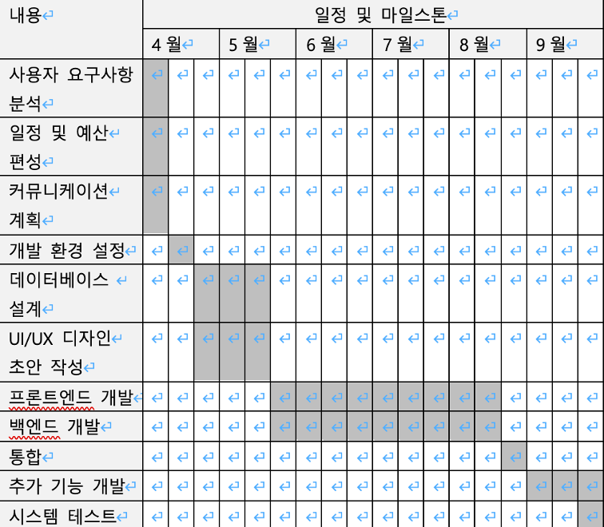

|프로젝트명|조건에 맞는 정책 지원금 산출 어플리케이션 기획/개발|||
| :- | :- | :- | :- |
|작성자|이동현, 최경봉, 송지연|문서버전|v.3.7.8|
|
프로젝트 

개요 및 배경
|국가통계포털(KOSIS)통계표에 따르면 높은 비중으로 ‘어떤 정책이 있는지 몰라서’라는 이유로 정책 지원금을 미수혜하고 있다. 이 문제를 해결하고자 자신의 조건을 기입하면 조건에 따른 정부지원금 목록을 산출하는 어플리케이션을 기획/개발하는 프로젝트이다.|||
|
프로젝트

목적과 당위성
|
- 목적 : 국민들이 다양한 정부 지원금에 대한 정보를 쉽게 얻을 수 있도록 함으로써, 정책 지원금 미수혜자들의 정보 접근성을 향상시키고 지원금 신청률을 증가시키는 것이다. 

- 당위성 : 정책 지원금에 대한 부정확한 정보나 정보의 부족으로 인해 정책 지원금을 받지 못하는 국민들이 많은 현실을 고려할 때, 정부의 정책을 보다 투명하게 알리고 지원금에 대한 정보를 보급함으로써 국민들의 복지 향상에 기여할 수 있다.
|||
|프로젝트 목표|
1. 정책 지원금 검색 기능: 사용자가 특정 조건(소득 수준, 가구 구성원 수, 거주 지역 등)을 입력하면 해당 조건에 맞는 정책 지원금을 검색할 수 있는 기능이 필요하다.

2. 정책 지원금 상세 정보 제공: 검색된 정책 지원금에 대한 상세 정보(지원 대상, 신청 자격, 신청 방법, 지원 금액, 신청 기간 등)를 제공해야 한다. 

3. 정책 지원금 알림 기능: 사용자가 관심 있는 정책 지원금에 대해 알림을 받을 수 있는 기능이 필요하다. 

4. 커뮤니티 및 FAQ 기능: 사용자들 간의 정보 공유를 위한 커뮤니티 기능과 질의응답을 할 수 있는 FAQ 기능이 필요하다. 

5. 접근성 및 사용 편의성: 어플리케이션의 사용이 쉽고 편리해야 한다. 사용자 친화적인 UI/UX 디자인과 접근성을 고려하여 모든 사용자가 쉽게 이용할 수 있도록 해야 한다. 

6. 데이터 업데이트: 정부의 정책이 변경될 때마다 새로운 정보를 업데이트하여 제공해야 한다. 
|||
|프로젝트 범위|
1. 지원 정책 검색 기능

&emsp;A. 해결하는 문제

&emsp;&emsp;i. 지원 정책 검색

&emsp;&emsp;ii. 카테고리별 검색

&emsp;&emsp;iii. 정책 지원 정보 제

2. 지원 정책 추천 기능

&emsp;A. 해결하지 않는 문제

&emsp;&emsp;i. 사용자 정보에 맞는 정책 추천

&emsp;&emsp;ii. 정책 지원 정보 제공

3. 자유게시판

&emsp;A. 해결하는 문제

&emsp;&emsp;i. FAQ

&emsp;&emsp;ii. 게시물 검색

&emsp;&emsp;iii. 게시물 작성/수정/삭제

&emsp;&emsp;iv. 댓글 작성/수정/삭제

&emsp;&emsp;v. 게시물 좋아요

4. 로그인/회원가입

&emsp;A. 해결하는 문제

&emsp;&emsp;i. 이메일 인증 시스템

5. 즐겨찾기 및 알림설정

&emsp;A. 해결하는 문제

&emsp;&emsp;i. 정책 즐겨찾기 등록

&emsp;&emsp;ii. 등록된 정책 알림 설정
|||
|성공 기준|프로젝트 목표의 기능들이 모두 구현되고 누적 사용자가 5000명 이상일 시 프로젝트 성공으로 판단한다. |||
|소요 자원|
- 예산: 회의실 예약 비용

- 시간: 약 6개월(2023.03.18 ~ 2023.06.14)

- 필요 인력: 5명

- 하드웨어: 개인 노트북 각 1대, 총 3대

- 대략적 예산 

&emsp;- MM = 27.86

&emsp;- 기간 : 6개월

&emsp;- 약 4.5MM이 필요하다.

&emsp;- 한 달 근무 시간을 160시간이라고 가정(대한민국 근로기준법 주 (40시간) X (4주) )

&emsp;- 시간당 임금이 30,000원이라고 가정했을 때, 한 달 급여는 4,800,000원

&emsp;- 4.5MM x 5명 x 4,800,000 = 108,000,000원

- 총 108,000,000원의 예산이 예상된다. 
|||
|
의사소통 및 

보고체계
|
1. 의사소통 채널 및 도구

- 일상적인 의사소통 및 온라인 회의: Slack을 통해 프로젝트 관련 대화, 질문, 업데이트 공유, 온라인 회의를 진행한다.

- 정기 회의: 대면 회의를 원칙으로 하며, 마일스톤 별로 관련 보고서 및 산출물을 작성하여 문서로 백업한다.

- 프로젝트 관리: Zira를 사용하여 프로젝트의 진행상황을 관리하고 추적한다. 

2. 정기 회의 및 보고 일정

- 매주 수요일 오후 6시에 오프라인으로 프로젝트 진행 상황 보고 및 중요 이슈에 대해 논의한다.
|||
|
일정 및

마일스톤
||||
|승인 요건|사전에 명시된 기능 및 성능 요구 사항을 만족하는 어플리케이션 개발을 완수하며, 모든 테스트 단계를 성공적으로 통과한다. |||
|승인|프로젝트 관리자: 이동현|||

# 작업분할도(WBS)
#
# 작업 의존 관계 파악

||||
| :- | :- | :- |
# CPM

# 간트차트

GFP

PCA

PCA = 0.65 = 0.01(처리복잡도 총합 = 39) = 1.04

FP = GFP x PCA = 627 \* 1.04 = 652.08

MM = FP / 생산성 = 652.08 / 23.4 = 27.86
